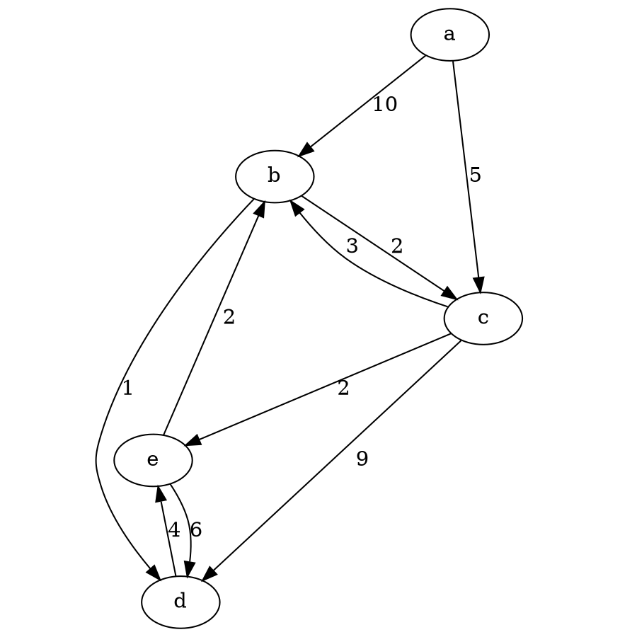

# Théorie des Graphes et Utilisation de Graphviz

## Théorie des Graphes

- **Graphe (G)** : Structure abstraite composée d'objets reliés ou non entre eux.
- **G = (V, E)** : V est l'ensemble des sommets, E est l'ensemble des arêtes.
- **Sommets (V)** : Points ou nœuds du graphe.
- **Arêtes (E)** : Liens entre les sommets.

### Caractéristiques

- **Simple** : Pas de boucles ni d'arêtes multiples.
- **Multigraphe** : Contient des boucles et/ou des arêtes multiples.
- **Orienté** : Arêtes avec direction (queue vers tête).
- **Non orienté** : Arêtes sans direction.
- **Pondéré** : Arêtes avec des poids.
- **Non pondéré** : Arêtes sans poids.
- **Connexe** : Chemin entre chaque paire de sommets.
- **Non connexe** : Pas de chemin entre certaines paires de sommets.
- **Cyclique** : Contient des circuits.
- **Acyclique** : Pas de circuits.

### Topologies

- **Hiérarchique**
- **Centralisé**
- **Quelconque**
- **Cyclique**
- **Homogène**

### Termes et Définitions

- **Densité** : $$D = \frac{2E}{V(V-1)}$$
- **Sommet** : Point ou nœud du graphe.
- **Chemin** : Séquence de sommets et d'arêtes sans répétition de sommets.
- **Arbre** : Graphe connexe acyclique.
- **Poids** : Valeur associée à une arête.
- **Arête** : Lien entre deux sommets.
- **Degré** : Nombre d'arêtes incidentes à un sommet.
- **Cycle** : Chemin fermé revenant au sommet initial.
- **Boucle** : Arête reliant un sommet à lui-même.
- **Ordre** : Nombre de sommets dans le graphe.
- **Diamètre** : Longueur du plus long chemin entre deux sommets.
- **Chaîne** : Séquence de sommets et d'arêtes.

### Algorithmes à Implémenter

- `addVertex` : Ajouter un sommet
- `addEdge` : Ajouter une arête
- `getNeighbours` : Récupérer les voisins d'un sommet
- `getDensity` : Récupérer la densité
- `getDiameter` : Récupérer le diamètre
- `hasCycle` : Vérifier si le graphe a des cycles
- `isConnected` : Vérifier si le graphe est connexe

### Parcours et Algorithmes de Chemin

- **Parcours** : Breadth First Search (BFS), Depth First Search (DFS)
- **Plus court chemin** : Dijkstra, Bellman-Ford-Moore

### Cas d'Usage

- Navigation GPS
- Analyse de page web (Google)
- Réseaux informatiques (réseaux : matériels, sociaux, ...)
- Gestion de projets (ordonnancement des tâches)
- Science (modélisation de protéines et gènes, cartographie)
- Réseaux industriels (eau, gaz, transport, ...)
- Et tellement d'autres

## Utilisation de Graphviz

```ps1
dot -Tpng digraph.dot -o digraph.png
```

### Commandes Principales

- **dot** : Génère des graphes dirigés.
- **neato** : Disposition des graphes non dirigés.
- **twopi** : Disposition radiale.
- **circo** : Disposition circulaire.
- **fdp** : Disposition basée sur les forces.

### Exemple de Fichier `.dot`

